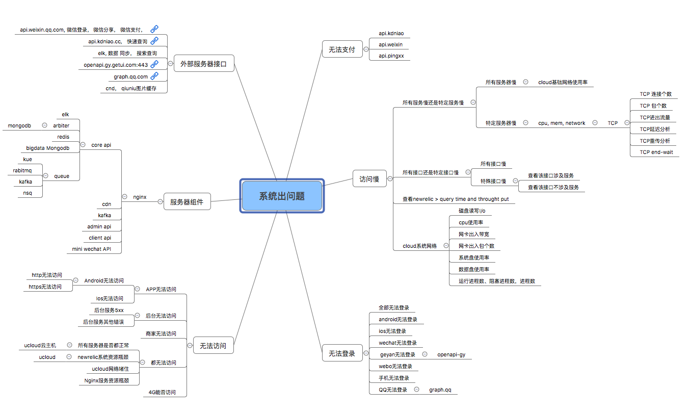

ultimate-js is my node work with Node.js

- **network** 

- **os linux**

   - [ipc | InterProcess Communication | shared mem| signal | pipe | message queue | sockets]()
   
- **docker**
  - 
- **databases**
  - [PostgreSQL](https://github.com/betty200744/ultimate-postgresql-mysql)
  - [MongoDB](https://github.com/betty200744/ultimate-postgresql-mysql)
  - [MySQL](https://github.com/betty200744/ultimate-postgresql-mysql)
  - [redis](https://github.com/betty200744/ultimate-postgresql-mysql)
- **APIs**
  - [rest]()  
  - [graphql]()  
  - [grpc]()  
  - [Authentication]()  
  - [express_ts](https://github.com/expressjs/express) | [code](awesome/express_ts/server.ts)
  - [koa_ts](https://koajs.com/#introduction) | [code](awesome/koa_ts/server.ts)
  - [koa](https://koajs.com/#introduction) | [code](awesome/koa/koa_server.js)
  - [egg]()
  
- **Docs**  
  - [elasticsearch](./docs/elasticsearch.md) 
  - [kafka](./docs/kafka.md) 
  - [rabbitmq](./docs/rabbitmq.md) 
  - [nsq](./docs/queue.md)
  - [cloud](./docs/cloud.md)
  - [docker](./docs/docker.md)
  - [mocha](./docs/mocha.md)  
  
- **Crypto** 
  - [Crypto]()  
- **javascript**
  - [declarations](./javascript/declarations/declarations.js) | [variables hoisting](./javascript/declarations/variable_hoisting.js) | block-scope  
  - [function declaration | function express | function hoisting](javascript/function/function_declarate.js)
  - [types | Boolean | null | undefined | Number | Bigint | String](./javascript/types/types.js)   
  - [type conversion](./javascript/types/type_conversion.js)
  - [control flow](./javascript/control_flow) | [if_else](./javascript/control_flow/if_else.js) | [switch](./javascript/control_flow/switch.js)
  - [iterations](./javascript/iterations) | [for | for in | for of](./javascript/iterations/for.js)  | [do-while](./javascript/iterations/do_while.js) 
  - [break](./javascript/terminates_statement/terminates.js) | [continue](./javascript/terminates_statement/terminates.js)
  - [try_catch_finally](./javascript/exception_handling/try_catch_finally.js)
  - [function](./javascript/function) | [declaration](./javascript/function/function_declarate.js) | [nested | closures](./javascript/function/function_nested_closures.js) 
  - function methods | [call](./javascript/function/function_methods_call.js) | [bind](./javascript/function/function_methods_bind.js) | [apply](./javascript/function/function_methods_apply.js)
  - function properties | [arguments | constructor| caller ](./javascript/function/function_properties.js)
  - [build-in-function | eval | parseInt | parseFloat | decodeURL](./javascript/build_in_functions/build_in_function.js)
  - **express_operators**
     - [unary | delete | typeof | in | instance of ](./javascript/expressions_operators/unary_ternary.js) | [ternary](./javascript/expressions_operators/unary_ternary.js)
     - todo[this](./javascript/expressions_operators/this.js)
     - todo[left-hand-side | new | super](./javascript/expressions_operators/new_super.js)
  -  **strings**
     - d
  -  **array**
     - [create | access | populate | length | iterating](./javascript/array/create_access.js)
     - [array methods | concat | push | pop | shift |slice | splice | reverse | sort | indexOf](./javascript/array/array_methods_operator.js)
     - [array methods | map | reduce | filter | forEach| every | some ](./javascript/array/array_methods_iterating.js)
     - [multi-dimensional array](./javascript/array/2d_object_array.js)
  -  **map** 
     - map method | [new | set | get | has | delete | keys | values | entries](./javascript/map/map.js)
     - map iterating[forEach | for of](./javascript/map/map.js)
  -  **set** 
     - set method | [add | has | delete ](./javascript/set/set.js)
     - set iterating | [forEach | for of](./javascript/set/set.js)
  -  **objects** 
     -  [create object](./javascript/objects/create_objects.js)
     -  [enumerate object](./javascript/objects/enumerate_objects.js)
     -  [object_methods](./javascript/objects/objects_methods.js)
     -  [object_inheritance](./javascript/objects/objects_inheritance.js)
     -  [function vs class vs java](./javascript/objects/function_vs_class_vs_java.js)
  -  **async**  
     -  [callback](./javascript/async/callback/callback.js)
     -  [promise](./javascript/async/promise/promise.js) | [create promise](./javascript/async/promise/create_promise.js)
     -  [Generator](./javascript/async/Generator/generator.js)
     -  [async/await](./javascript/async/async_await/async_await.js)    
- **Es6**
   - [scoping and without hoisting](./es6/scoped.js)
   - [arrow functions](./es6/arrow_functions/arrow_function.js)
   - [default parameter](es6/parameter/default_parameter.js)
   - [rest parameter](./es6/parameter/rest_parameter.js)
   - [spread operator](./es6/parameter/rest_parameter.js)
   - [template literals](./es6/template_literal.js)
   - [shorthand property](es6/object_properties/shorthand_property.js)
   - [Computed Property Name](es6/object_properties/computed_property_name.js)
   - [method property](./es6/build_in_methods/build_in_methods.js)   
   - [destructuring assignment](./es6/destructuring/destructuring.js)
   - [Promise](./javascript/async/promise/promise.js)
   - [Generators](./javascript/async/Generator/generator.js)
   - [export](https://developer.mozilla.org/zh-CN/docs/Web/JavaScript/Reference/Statements/export) |[import](https://developer.mozilla.org/zh-CN/docs/Web/JavaScript/Reference/Statements/import)
   - [class](./es6/classes) | [class definition](./es6/classes/class_definition.js) | [class inheritance](./es6/classes/class_inheritance.js)
   - [Proxy](./es6/proxy/proxy.js)
   
- **design patterns**  [design patterns](https://loredanacirstea.github.io/es6-design-patterns/#builder)
  - Creational
    - Simple Factory: [wiki](https://en.wikipedia.org/wiki/Factory_(object-oriented_programming)) 
    - *Abstract factory: [wiki](https://en.wikipedia.org/wiki/Abstract_factory_pattern) | [code](design-patterns/creational/abstract_factory/abstract_factory.js) | [best practices]()
    - *Builder: [wiki](https://en.wikipedia.org/wiki/Builder_pattern) | [code1](design-patterns/creational/builder/builder.js) | [best practices orm query build]() 
    - Factory method: [wiki](https://en.wikipedia.org/wiki/Factory_method_pattern) | [code](design-patterns/creational/factory_method/factory_method.js) | [best practices]()
    - *Prototype: [wiki](https://en.wikipedia.org/wiki/Prototype_pattern) | [code](./design-patterns/creational/prototype/prototype.js) | [best practices]() 
    - *Singleton: [wiki](https://en.wikipedia.org/wiki/Singleton_pattern) | [code](./design-patterns/creational/singleton/singleton.js) | [best practices]() 
  - Structual
    - Adapter(wrapper): [wiki](https://en.wikipedia.org/wiki/Adapter_pattern) | [code](./design-patterns/structual/adapter/adapter.js) | [best practices]() 
    - *Bridge: [wiki](https://en.wikipedia.org/wiki/Bridge_pattern) | [code](./design-patterns/structual/bridge/bridge.js) | [best practices]() 
    - Composite: [wiki](https://en.wikipedia.org/wiki/Composite_pattern) | [code](./design-patterns/structual/composite/composite.js) | [best practices]() 
    - *Decorator: [wiki](https://en.wikipedia.org/wiki/Decorator_pattern) | [code](./design-patterns/structual/decorator/decorator.js) | [best practices]() 
    - Facade: [wiki](https://en.wikipedia.org/wiki/Facade_pattern) | [code](./design-patterns/structual/facade/facade.js) | [best practices]() 
    - Flyweight: todo[wiki](https://en.wikipedia.org/wiki/Flyweight_pattern) | [code](./design-patterns/structual/flyweight/flyweight.js) | [best practices]() 
    - Proxy: todo[wiki](https://en.wikipedia.org/wiki/Proxy_pattern) | [code](./design-patterns/structual/proxy/proxy.js) | [best practices]() 
  - Behavioral
    - *Chain of responsibility(middleware): [wiki](https://en.wikipedia.org/wiki/Chain-of-responsibility_pattern) | [code](./design-patterns/behavioral/chain_of_responsibility/chain_of_responsibility.js) | [best practices]() 
    - Command: todo [wiki](https://en.wikipedia.org/wiki/Command_pattern) | [code]() | [best practices]() 
    - *Interpreter: todo[wiki](https://en.wikipedia.org/wiki/Interpreter_pattern) | [code]() | [best practices]() 
    - *Iterator: [wiki](https://en.wikipedia.org/wiki/Iterator_pattern) | [code]() | [best practices]() 
    - Mediator: todo[wiki](https://en.wikipedia.org/wiki/Mediator_pattern) | [code]() | [best practices]() 
    - Memento: todo[wiki](https://en.wikipedia.org/wiki/Memento_pattern) | [code]() | [best practices]() 
    - Observer: todo[wiki](https://en.wikipedia.org/wiki/Observer_pattern) | [code]() | [best practices]() 
    - State: todo[wiki](https://en.wikipedia.org/wiki/State_pattern) | [code]() | [best practices]() 
    - *Strategy: [wiki](https://en.wikipedia.org/wiki/Strategy_pattern) | [code](./design-patterns/behavioral/strategy/strategy.js) | [best practices]() 
    - Template method : todo[wiki](https://en.wikipedia.org/wiki/Template_method_pattern) | [code]() | [best practices]() 
    - Visitor: todo[wiki](https://en.wikipedia.org/wiki/Visitor_pattern) | [code]() | [best practices]() 

- **typescript**
   - [doc](./typescript/typescript.md)
   - **Basic Types**
      - [boolean | number | string | array | tuple | enum | any | null | undefined | type aliases](typescript/basic_types/basic_type.ts)
      - [type_assertions](typescript/basic_types/type_assertions.ts)
   - **interfaces**
      - [properties | optional | readonly | excess](./typescript/interfaces/interface_properties.ts)
      - [function types](./typescript/interfaces/interface_function_types.ts)
      - [implements_interface](./typescript/interfaces/class_implements_interface.ts)
      - [extents_interface](./typescript/interfaces/interface_extends_interface.ts)
      - [hybrid_types](./typescript/interfaces/interface_hybrid_types.ts)
      - [keyof](./typescript/interfaces/interface_hybrid_types.ts)
   - **functions**
      - [function_type_and_inferring](./typescript/functions/function_type_and_inferring_type.ts)
      - [option | default | rest parameters](./typescript/functions/option_default_rest_parameters.ts)
   - **unions and intersection types**
      - [unions types](./typescript/unions_and_intersection_types/union_types.ts)
      - [intersection types](./typescript/unions_and_intersection_types/intersection_types.ts)
   - **classes**
      - [classes extends](./typescript/classes/class_extends_class.ts)
      - [public | private | protected](./typescript/classes/public_private_protected.ts)
      - [readonly | static](./typescript/classes/public_private_protected.ts)
      - [constructor | parameter properties ](./typescript/classes/public_private_protected.ts)
   - **Enums**
      - [number enum | string enum](./typescript/enums/enums.ts)
      - [iterator enum](./typescript/enums/enums_iterator.test.ts)
   - **generic**
      - [function | parameters | response](./typescript/generics/generics_function.ts)
      - [interface](./typescript/generics/generics_interface.ts)
      - [classes](./typescript/generics/generics_classes.ts)
      - [class_types](./typescript/generics/class_types_in_generics.ts)
      - [generics_type_extends_types](./typescript/generics/generics_types_extends_types.ts)
   - **advanced types**
      - [type_guards](./typescript/advanced_types/type_guards.ts)
   - **utility types**
      - Partial<Type>
   - **decorators**
      - [decorator function](./typescript/decorators/decorator_function.ts)
      - [decorator factory](./typescript/decorators/decorator_function.ts)
      - [class decorators | observe | modify | replace class definition](./typescript/decorators/class_decorators.ts)
      - [method decorators | observe | modify |  replace method definition](./typescript/decorators/method_decorators.ts)
      - [property decorators](./typescript/decorators/property_decorators.ts)
      - [parameter decorators](./typescript/decorators/parameter_decorators.ts)
      - [accessor decorators](./typescript/decorators/accessor_decorators.ts)
   - **modules**
      - [export](./typescript/modules/export)
      - [import](./typescript/modules/import) 
- **Node.js**
   - [nvm](https://github.com/nvm-sh/nvm)
   - [npm](https://www.npmjs.com/)
   - [npx](https://www.npmjs.com/package/npx)
   - [n](https://github.com/tj/n)
  
- **Algorithms** [Algorithms]()
   - Data Structures
     - [Linked List](http://en.wikipedia.org/wiki/Linked_list)
     - [Singly Linked List](algorithm/data-structures/singly-linked-list/singlyLinkedList.ts)  |  [(wiki)](https://en.wikipedia.org/wiki/Linked_list#Singly_linked_list)
     - [Doubly linked list](./algorithm/data-structures/double-linked-list/doubleLinkedList.ts)  |  [(wiki)](https://en.wikipedia.org/wiki/Doubly_linked_list)
     - [Queue](./algorithm/data-structures/queue/queue.test.ts)  | [(wiki)](http://en.wikipedia.org/wiki/Queue_%28abstract_data_type%29)
     - [Stack](./algorithm/data-structures/stack/stack.test.ts)  | [(wiki)](http://en.wikipedia.org/wiki/Stack_%28abstract_data_type%29)
     - [Hash Tables](./algorithm/data-structures/hash-table/hashTable.ts)  | [(wiki)](http://en.wikipedia.org/wiki/Hash_table)      
     - [Heap](./algorithm/data-structures/heap/heap.ts)  | [(wiki)](http://en.wikipedia.org/wiki/Heap_%28data_structure%29)
     - [Max Heap](./algorithm/data-structures/heap/maxHeap.ts)  | [(wiki)](http://en.wikipedia.org/wiki/Heap_%28data_structure%29)
     - [Min Heap](./algorithm/data-structures/heap/minHeap.ts)  | [(wiki)](http://en.wikipedia.org/wiki/Heap_%28data_structure%29)
     - [Binary Tree](./algorithm/data-structures/tree/binaryTreeNode.ts) |  [(wiki)](http://en.wikipedia.org/wiki/Binary_tree)
     - [Binary Search Tree](./algorithm/data-structures/tree/binarySearchTree.ts) | [Binary Search Tree Node](./algorithm/data-structures/tree/binarySearchTreeNode.ts)  |  [(wiki)](https://en.wikipedia.org/wiki/Binary_search_tree) | [(mit)](https://ocw.mit.edu/courses/electrical-engineering-and-computer-science/6-006-introduction-to-algorithms-fall-2011/lecture-videos/MIT6_006F11_lec05.pdf)
     - [AVL Tree | height balanced binary search tree ](https://github.com/trekhleb/javascript-algorithms/tree/929b210b8e02cd77bdc3575a4e897ad24ad64ad3/src/data-structures/tree/avl-tree)  | [code](./algorithm/data-structures/tree/avlTree.ts)|  [(wiki)](https://en.wikipedia.org/wiki/AVL_tree) | [(mit)](https://ocw.mit.edu/courses/electrical-engineering-and-computer-science/6-006-introduction-to-algorithms-fall-2011/lecture-videos/MIT6_006F11_lec06.pdf) 
     - [Fenwick Tree  | Binary Indexed Tree ]() |  [(wiki)]() | [(mit)]()
     - [Red-Black Tree ]() |  [(wiki)]() | [(mit)]()
     - [Graph]()[(wiki)](http://en.wikipedia.org/wiki/Graph_%28abstract_data_type)
     - [Matrix]()  | [(wiki)](http://en.wikipedia.org/wiki/Matrix_(mathematics))
   - [Sorting algorithms](https://en.wikipedia.org/wiki/Sorting_algorithm)
     - [Bubble Sort](./algorithm/sorting-algorithms/bubbleSort.ts) | [(wiki)](http://en.wikipedia.org/wiki/Bubble_sort)
     - [Selection Sort](./algorithm/sorting-algorithms/selectionSort.ts) [(mit notes)]() | [(wiki)](http://en.wikipedia.org/wiki/Selection_sort)
     - [Insertion Sort](./algorithm/sorting-algorithms/insertionSort.ts)[(mit notes)](https://ocw.mit.edu/courses/electrical-engineering-and-computer-science/6-006-introduction-to-algorithms-fall-2011/lecture-videos/MIT6_006F11_lec03.pdf) | [(wiki)](http://en.wikipedia.org/wiki/Insertion_sort)
     - [Heap Sort](./algorithm/sorting-algorithms/heapSort.ts) [(mit notes)](https://ocw.mit.edu/courses/electrical-engineering-and-computer-science/6-006-introduction-to-algorithms-fall-2011/lecture-videos/MIT6_006F11_lec04.pdf) | [(wiki)](http://en.wikipedia.org/wiki/Heapsort)
     - [Merge Sort](./algorithm/sorting-algorithms/mergeSort.ts) [(mit notes)](https://ocw.mit.edu/courses/electrical-engineering-and-computer-science/6-006-introduction-to-algorithms-fall-2011/lecture-videos/MIT6_006F11_lec03.pdf) | [(wiki)](http://en.wikipedia.org/wiki/Merge_sort)
     - [Quick Sort](./algorithm/sorting-algorithms/quickSort.ts)[(mit notes)]() | [(wiki)](http://en.wikipedia.org/wiki/Quicksort)     
     - [Shell Sort](./algorithm/sorting-algorithms/shellSort.ts)[(mit notes)]() | [(wiki)](http://en.wikipedia.org/wiki/Shellsort)
   - Graph algorithms
     - Searching:
       - [Depth First Search]()  |  [(wiki)](http://en.wikipedia.org/wiki/Depth-first_search)
       - [Breadth First Search]()  |  [(wiki)](http://en.wikipedia.org/wiki/Breadth-first_search)
       - [Binary Search](./algorithm/search-algorithms/binarySearch.ts) | [(wiki)](http://en.wikipedia.org/wiki/Binary_search_algorithm)
       - [Linear Search](./algorithm/search-algorithms/linearSearch.ts) | [(wiki)](http://en.wikipedia.org/wiki/Binary_search_algorithm)
       - [Binary Search Recursive](./algorithm/search-algorithms/binarySearchRecursive.ts) | [(wiki)](http://en.wikipedia.org/wiki/Binary_search_algorithm)
   - hortest path:
     - [Dijkstra]()  | [(wiki)](http://en.wikipedia.org/wiki/Dijkstra%27s_algorithm)
   - Sorting:
     - [Topological Sort]()  |  [(wiki)](http://en.wikipedia.org/wiki/Topological_sorting)
   - Maths algorithms
     - [Binary GCD algorithm]()  |  [(wiki)](https://en.wikipedia.org/wiki/Binary_GCD_algorithm)
     - [Closest pairs]()  | [(wiki)](http://en.wikipedia.org/wiki/Closest_pair_of_points_problem)
     - [FastPower]()  | [(wiki)](http://en.wikipedia.org/wiki/Exponentiation_by_squaring)
     - [Fibonacci]()  | [(wiki)](http://en.wikipedia.org/wiki/Fibonacci_number)
     - [Fisher-Yates Shuffle-yates]()  |  [(wiki)](http://en.wikipedia.org/wiki/Fisher%E2%80%93Yates_shuffle)
     - [Erastothenes Sieve]()  |  [(wiki)](https://en.wikipedia.org/wiki/Sieve_of_Eratosthenes)
     - [Extented GCD algorithm]()  |  [(wiki)](http://en.wikipedia.org/wiki/Extended_Euclidean_algorithm)
     - [Karatsuba's Multiplication]()  |  [(wiki)](http://en.wikipedia.org/wiki/Karatsuba_algorithm)
     - [Newton's Squarenewton-sqrt]()  |  [(wiki)](http://en.wikipedia.org/wiki/Newton%27s_method)
     - [Permutations Count]()
     - [Strassen's matrixstrassen]() |  [(wiki)](http://en.wikipedia.org/wiki/Strassen_algorithm)
- **awesome**
  - [external services](./docs/external_services.md)
  - [async-file]()
  - [typeorm]()
  - [ramda]()
  - [amqplib]()
  - [bcryptjs]()
  - [jsonwebtoken]()
  - [protobufjs]()
  - [deno]()
  - [inversity](https://github.com/inversify/InversifyJS)
  - [passport](https://github.com/jaredhanson/passport)

  