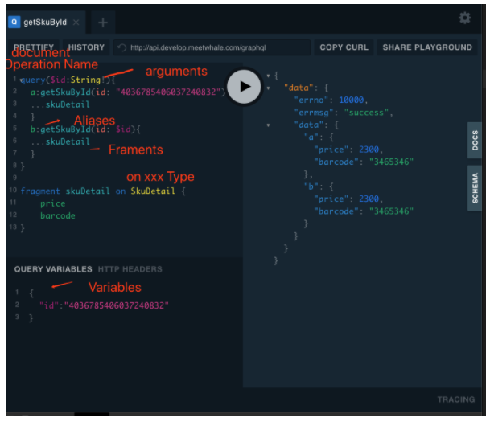
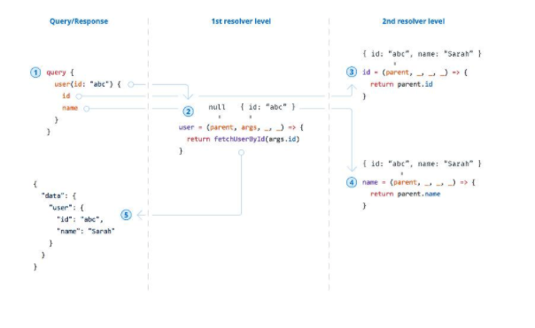
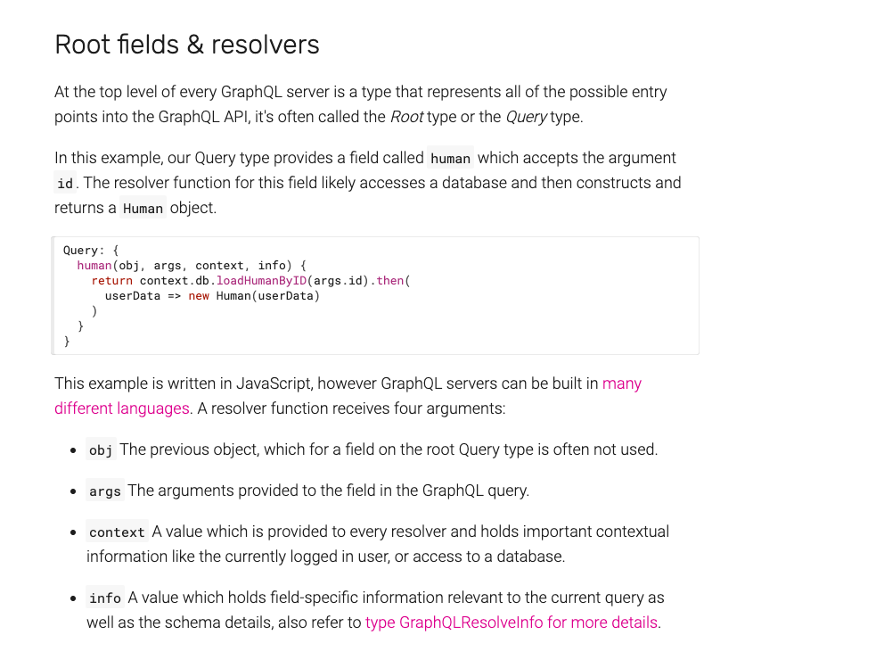

### Graphql
* Domain Specific Query Language
* 
### doc
* learn: https://graphql.org/learn/
* spec:  http://spec.graphql.org/draft/#sec-Overview
* 

### 优点
* 
* client动态请求
* server动态调用
* graphql server接口整合
* graphql validation 请求类型检查
* 文档清晰, Mock数据, 并行开发

### 特点
* graphql返回才有http错误
* 所有handle返回都是200

### 主要功能
* 解析request
* 加载resolver
* 执行resolver
* 封装response

### Query and Mutations (client)
* https://graphql.org/learn/queries/
* Document, http://spec.graphql.org/draft/#sec-Document-Syntax
* Fields,
* Arguments,
* Aliases , method重复调用的时候可以用
* Fragments, 重复代码片段, 注意on xxx Type如 on SkuDetail
* Operation Name
* Variables
* Directives, 装饰器
* Mutations
* Inline Fragments

### Schemas and Types (server)
* https://graphql.org/learn/schema/
* Type System
* Type Language
* Object Types and Fields
* Arguments
* The Query and Mutation Types
* Scalar Types
* Enumeration Types , string
* Lists and Non-Null
* Interfaces
* Union Types
* Input Types

### Validation
* https://graphql.org/learn/validation/

### Execution

* Executing Requests
    * `ExecuteRequest(schema, document, operationName, variableValues, initialValue)`
        * ExecuteQuery(operation, schema, coercedVariableValues, initialValue).
        * ExecuteMutation(operation, schema, coercedVariableValues, initialValue).
        * Subscribe(operation, schema, coercedVariableValues, initialValue).
* Executing Operations
    * Query
    * Mutation

* Executing Selection Sets
    * ExecuteSelectionSet(selectionSet, queryType, initialValue, variableValues) normally (allowing parallelization)
* Executing Fields
    * ExecuteField(objectType, objectValue, fieldType, fields, variableValues)

### Response, 
* 情况一: {"data": {}}
* 情况二: {}
* 情况三: {}
* 情况四: {}

* validation Introspection error response, 

* handle error response

* success response

### reference
* http://graphql.org/learn/ 
* http://facebook.github.io/graphql/
* https://github.com/facebook/graphql
* https://github.com/graphql/express-graphql
* https://www.npmjs.com/package/graphql-tools
* 

