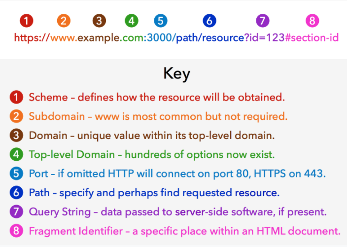
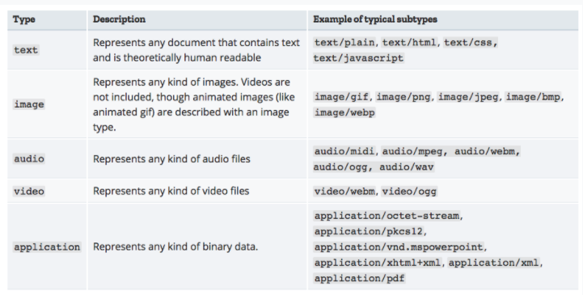
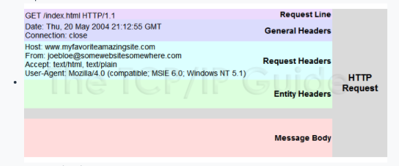
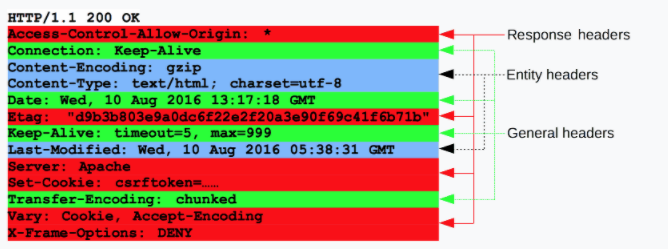
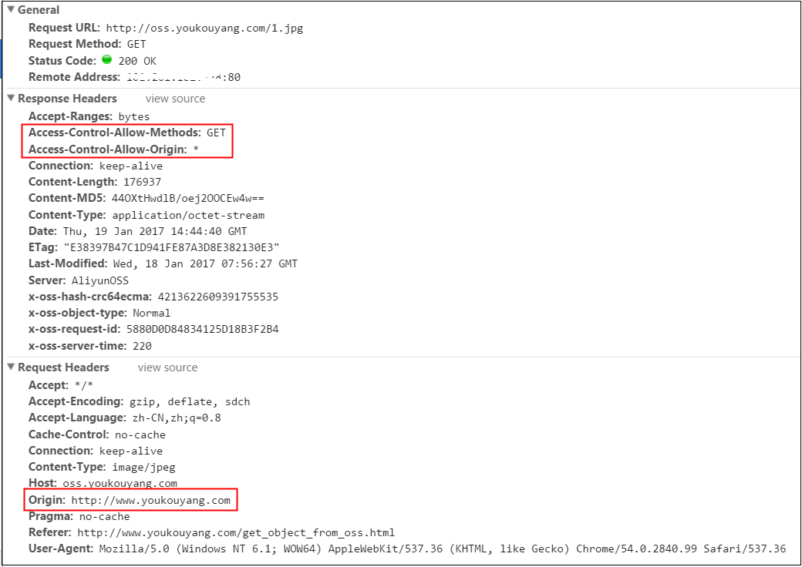
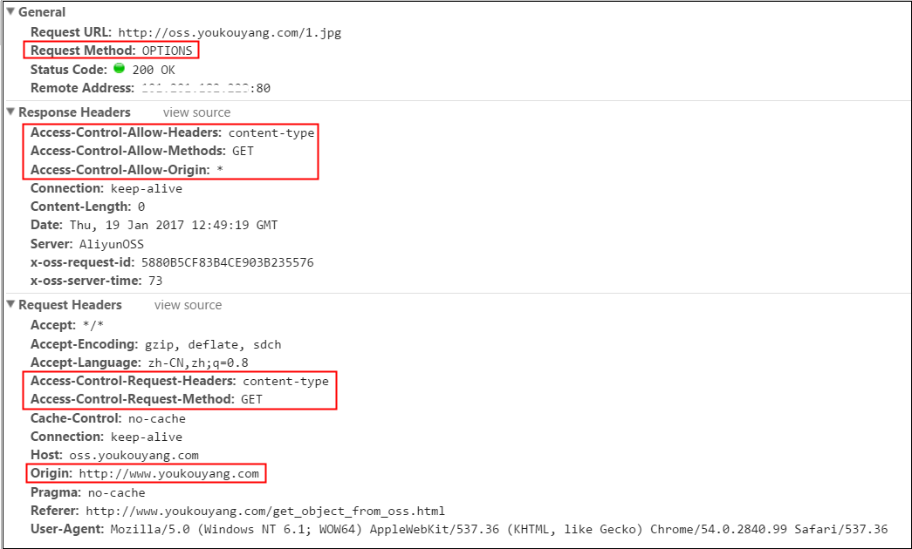

###基础
- http 协议是建立在 tcp/ip 协议基础上 。 
- http 协议全称超文本传输协议 。 
- http 协议1.0 , 1.1, 2.0版本，目前通用的是1.1版本 
- http1.0 称为短连接, 因为默认connection: false 
- http1.1 , http2.0 称为长连接, 因为默认connection: Keep-alive


###http RFC

- https://developer.mozilla.org/en-US/docs/Web/HTTP
-  RFC2616 - HTTP/1.0， http://www.rfc-base.org/rfc-2616.html ， 已经废弃
-  RFC6838 - 媒体协议， https://tools.ietf.org/html/rfc6838
- -RFC7230 - , 主协议，HTTP/1.1: Message Syntax and Routing - low-level message parsing and connection management 
- RFC7231 - 子协议，HTTP/1.1: Semantics and Content - methods, status codes and headers
- RFC7232 - 子协议，HTTP/1.1: Conditional Requests - e.g., If-Modifieddd-Since
- RFC7233 - 子协议，HTTP/1.1: Range Requests - getting partial content
- RFC7234 - 子协议，HTTP/1.1: Caching - browser and intermediary caches
- RFC7235 - 子协议，HTTP/1.1: Authentication - a framework for HTTP authentication
- RFC6455, websocket协议，https://tools.ietf.org/html/rfc6455
- RFC2817, TLS升级协议， https://tools.ietf.org/html/rfc2817
- RFC7540, http2.0升级协议， https://tools.ietf.org/html/rfc7540

###http  urls syntax



- http parameters , http query , 
  - this parameters 
```
// ?name=tobi
req.param('name')
// => "tobi"

// POST name=tobi
req.param('name')
// => "tobi"

// /user/tobi for /user/:name
req.param('name')
// => "tobi"
```
- 
   - this query 
```
// GET /search?q=tobi+ferret
req.query.q
// => "tobi ferret"

// GET /shoes?order=desc&shoe[color]=blue&shoe[type]=converse
req.query.order
// => "desc"

req.query.shoe.color
// => "blue"

req.query.shoe.type
// => "converse"
```


###http MIME , http媒体协商
- multipurpose internet mail extensions , 媒体类型， 同sip的sdp
- text/plain ，文本类型，用于直接显示
- text/html， html类型，用于解析后显示
- image/jpeg 
- image/png
- audio/mpeg
- audio/ogg
- audio/*
- video/mp4
- application/octet-stream , 二进制文件
- multipart/form-data , 表单类型



###http  header 
- request header
- 
- response header


###http body 


###http connection management
- 基础协议需要携带connection头域， 特殊如(Keep-Alive, Transfer-Encoding, TE, Connection, Trailer, Upgrade, Proxy-Authorization and Proxy-Authenticate), 则可以不带
- Upgrade,为websocket 升级协议
- connection: close
- conection: Keep-Alive

###http upgrade
- Upgrading to an HTTP/2 connection
```
GET / HTTP/1.1
Host: destination.server.ext
Connection: Upgrade, HTTP2-Settings
Upgrade: h2c
HTTP2-Settings: base64EncodedSettings

HTTP/1.1 101 Switching Protocols
Connection: Upgrade
Upgrade: h2c

[standard HTTP/2 server connection preface, etc.]
```
- Upgrading to a WebSocket connection
```
Connection: Upgrade
Upgrade: websocket

```
- Upgrading to TLS 
```
GET http://destination.server.ext/secretpage.html HTTP/1.1
Host: destination.server.ext
Upgrade: TLS/1.0
Connection: Upgrade

HTTP/1.1 101 Switching Protocols
Upgrade: TLS/1.0, HTTP/1.1

```
###http access control , CORS, 跨域
- CORS, Cross-Origin Resource Sharing, 
- 当一个请求url的协议、域名、端口三者之间任意一与当前页面地址不同即为跨域。
- 
- ”浏览器， 服务器“， 不允许代码向不同的域名发出请求， 即一个document只能向一个domain发出请求

####客户端跨域处理
- 跨域请求携带如下红色标注信息
- Access-Control-Allow-Methods, 即我是撒方法
- Access-Control-Allow-Origin, 
- Origin,我的原来请求为




####服务器跨域处理
- 首先查看http头部有无origin字段；
- 如果没有，或者不允许，直接当成普通请求处理，结束；
- 如果有并且是允许的，那么再看是否是preflight(method=OPTIONS)；
- 如果不是preflight（简单请求），就返回Allow-Origin、Allow-Credentials等，并返回正常内容。
- 如果是preflight（预先请求），就返回Allow-Headers、Allow-Methods等，内容为空；

####Nginx Proxy 跨域配置


###http authentication

###http caching 
- 浏览器缓存
- Nginx Proxy缓存
- Redis缓存
- Express服务器缓存，

http://www.cnblogs.com/qingmingsang/articles/7464715.html


###http compression
- 压缩， br, gzip 
- 打包

###http conditional request 
- 缓存更新机制
- 增量下载的完整性机制
- 处理资源的首次上传问题，避免重复上传


###http Cookie, 


- cookie , 服务器发的， 存在客户端， 如浏览器
- browser session, https://developer.mozilla.org/zh-CN/docs/Web/API/Window/sessionStorage
- server  session, 服务器发的， 存在服务端， 
- 

#### cookie作用


- 身份识别 ，以便记录身份， 对不同人做不同处理及返回
- 会话状态管理（如用户登录状态、购物车、游戏分数或其它需要记录的信息）
- 个性化设置（如用户自定义设置、主题等）
- 浏览器行为跟踪（如跟踪分析用户行为等

####browser localStorage
- 同sessionStorage, 保存在本地， 不会随着tcp连接断开而删除， 一直存在
- localStorage, key, value ,  一个域名对应一个， 可setItem, getItem, removeItem
- 

####browser sessionStorage
- 所谓session， 会话， 就是tcp 建立连接， 
- 所谓sessionStorage,  就是tcp连接建立是才保持的token  or cookie，也就是服务器给的`身份标识`
- sessionStorage, key , value ， 可以setItem, 也可以getItem, 也可以remove, clear
- session, 打开页面， tcp建立连接，
- session, 关闭页面， tcp断开连接，
- 

####server session 

###http flow 

### http response 


