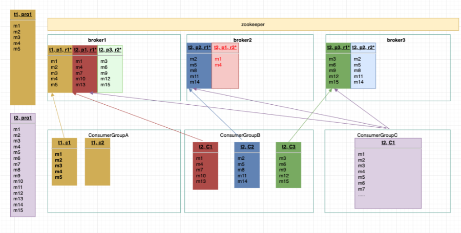
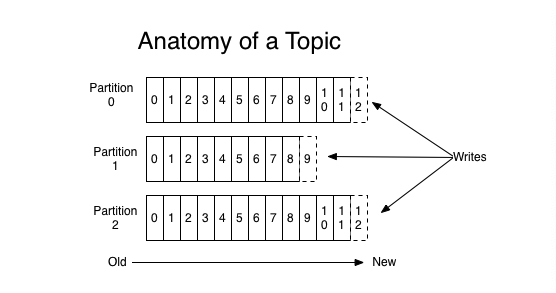
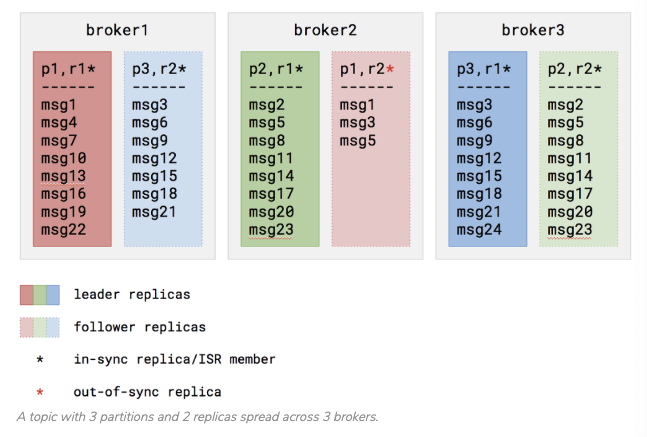

### Document

* ref: https://kafka.apache.org/
* api: https://github.com/Shopify/sarama
* command: https://pavelmakhov.com/2017/03/useful-kafka-commands/
* ecosystem:  https://cwiki.apache.org/confluence/display/KAFKA/Ecosystem
* tools:  https://github.com/Shopify/sarama/tree/master/tools , 压测



### introduction
* 整体基于tcp传输
* zookeeper, zap应用协议
* broker, zap and kafka应用协议
* producer, kafka协议
* consumer, kafka协议
* kafka, a messaging system
* kafka, a storage system
* kafka, Stream Processing
* kafka, acknowledgement保证消息写入成功
* kafka, 因为cluster， 所以并发高

### 本地kafka演示


###### `启动流程`
* 启动zookeeper
* 启动Broker, 即server
* 创建topic, 
* 启动Producer Client, 发送消息
* 启动Consumer Client, 消费消息
* 启动ConsumerGroup Client, 消费消息

###### `启动zookeeper`
```
cd /Users/betty/project/kafka_2.11-1.0.1
bin/zookeeper-server-start.sh config/zookeeper.properties
```
###### `启动Service or Broker`
```
bin/kafka-server-start.sh config/server.properties
```
###### `创建topic， 修改topic`
``` 
* bin/kafka-topics.sh --create --zookeeper localhost:2181 --replication-factor 1 --partitions 6 --topic test // 创建
* bin/kafka-topics.sh --alter --zookeeper localhost:2181 --topic my-topic --replication-factor 3 //增加副本集，replication-factor即一个partitions的副本集
* bin/kafka-topics.sh --list --zookeeper localhost:2181 //查看所有topic
* bin/kafka-topics.sh --describe --zookeeper localhost:2181 --topic test5 //查看具体topic详情

```


###### `启动producer`

```
bin/kafka-console-producer.sh --broker-list localhost:9092 --topic test1
```
###### `启动consumer`

```
bin/kafka-console-consumer.sh --bootstrap-server localhost:9092 --topic test1 --from-beginning --group 1
```


##### `list consumer group`

```
➜  bin ./kafka-consumer-groups.sh -bootstrap-server 10.168.0.218:9092 -list
Note: This will not show information about old Zookeeper-based consumers.

1
whale-data-bus
whale-wq-actualizer-worker
kafka-wq-search
whale-device-sku-binding
whale-chunnel-develop
whale-device-operation
whale-worker-queue
whale-clone-data
whale-mkt-activity
whale-export
whale-order-fsm
whale-device-report
whale-operation-log
whale-wq-worker
```

### kafka quick start

* 场景一：1 broker, 1 replication, 1 producers，1 partitions, 1 consumer，单例
* 场景二：1 broker, 1 replication, 1 producers，n partitions, 1 group(n consumer), 消费负载均衡
* 场景三：1 broker, 1 replication, 1 producers，n partitions, n group(不同名即不同group)，广播用于做不同的任务
* 场景四：3 broker, 2 replication, 1 producers，n partitions, 1 group(n consumer), 消费负载均衡 


- `Zookeeper`
    - 管理broker，管理topic 
    - producer or consumers都可以连接zookeeper来获取broker, broker必须到zookeeper注册才可以开启
- `Broker` 
    - 即server, 一台host可以起多个server，一般情况多台host
- `Topic`
    - 配置多个partitions用于并发，
    - 配置多个replication用于容灾，注意replication针对的是每一个partition
- `Producers`
    - kafka client, 消息发送者， 可向多个partitions发送消息
- `Consumers`，
    - kafka client, 消息消费者， 自行维护offset, 
    - kafka client, 可以从头消费，也可消费最新的 
- `ConsumerGroup` 
    - 同名group则load balanced, 注意组内任何一个consumer挂了都会重新rebalance, 即重新clear and setup
    - 不同名group则broadcast, 用于不同任务处理
    - 组内Comsumer能消费0-n个partition, 
    - 一个partition只能被comsumerGroup里面一个consumer读取
- `Partitions`
    - 对于producers, 可向不同partition并发写， 注意一个msg只会出现再一个patition
    - 对于consumers, 可读0, 1, n个partitions
    - 如果有n个replication， 那么每个partitions都有n个replication
    - 注意如果partition没有replication， 你们当前server挂了， 就无法发数据也无法收数据
- `Replication-factor`
    - 为partitions的副本集节点，用于容灾, 否则topic创建好partition就确定了broker不会变了
    - 每一个partition都有1个leader和0 or n个follers,  
    - 注意replication-factor不能大于broker数

### Topics and Logs

- topic, name of message records, 
- topic, 配置多个partitions用于并发，每个partition可有多个replication用于容灾
- topic, zero, one, or many consumers



### Distribution and Partition

- partitions, producers并发写， 可向不同partitions并发写， 注意一个event只会出现再一个patition, 
- partitions, 如果有n个replication， 那么每个partitions都有n个replication
- partitions, consumer, 可读多个partitions, 
- replication-factor, partitions的副本集节点，用于容灾, 每一个partition都有1个leader和0 or n个follers,  注意replication-factor不能大于broker数
* Each partition has one server which acts as the "leader" and zero or more servers which act as "followers".



### Producers
- Producers, kafka client, 按照round-robin 或者其他策略发送到不同的partitions
- Producers, kafka client, 消息发送者， 可向多个partitions发送消息


### Consumers
- If all the consumer instances have the same consumer group, then the records will effectively be load balanced over the consumer instances.
- If all the consumer instances have different consumer groups, then each record will be broadcast to all the consumer processes.
- Consumers，kafka client, 消息消费者， 自行维护offset, 
- ConsumerGroup, 同名group则load balanced, 不同名group则broadcast, 用于不同任务处理
- ComsumerGroup, 组内Comsumer能消费0-n个partition, 
- ComsumerGroup, 一个partition只能被comsumerGroup里面一个consumer读取


### 存在的问题

* 配置问题, topic partitions, 并发配置，配置与etcd的配置需要同步，否则存在如下问题
    * partitions多了， producer发送失败
    * partitions少了， 浪费服务器，也浪费consumer
* 配置问题, topic partitions, 并发配置，producer快，一般一个，consumerGroup慢，一般与pod数同步
* 配置问题, topic replication-factor, 容错配置，一般2个就够了，即主从备份，减少数据同步，也就减少出错
* 配置问题, consumer group, 不要删consumer group, 要删先etcd 及代码先删除
* 代码问题, consumer group, 即load balanced, 注意组内任何一个consumer挂了都会重新rebalance, 即重新clear and setup， 所以consumer需要放到loop里面
* 版本问题, consumer group, 不同topic但consumer group名相同， 之前存在报错，kafka server 


### 用户场景

#### 1 broker, 1 replication, 1 producers，1 partitions, 1 consumer，单例

* producer1
`bin/kafka-console-producer.sh --broker-list localhost:9092 localhost:9093 localhost:9094 --topic test1`
* consumer1
`bin/kafka-console-consumer.sh --bootstrap-server localhost:9092 localhost:9093 localhost:9094 --topic test1 --from-beginning`

#### 1 broker, 1 replication, 1 producers，n partitions, 1 group(n consumer), 消费负载均衡
* 注意一个consumer可能负责到0， 1， n个partitions
* producer1
`bin/kafka-console-producer.sh --broker-list localhost:9092 --topic test1`
* consumer1
`bin/kafka-console-consumer.sh --bootstrap-server localhost:9092 --topic test1 --from-beginning --group 1`
* consumer2
`bin/kafka-console-consumer.sh --bootstrap-server localhost:9092 --topic test1 --from-beginning --group 1`
#### 1 broker, 1 replication, 1 producers，n partitions, n group(不同名即不同group)，广播用于做不同的任务
* producer1
`bin/kafka-console-producer.sh --broker-list localhost:9092 --topic test1`
* consumer1
`bin/kafka-console-consumer.sh --bootstrap-server localhost:9092 --topic test1 --from-beginning --group 1`
* consumer2
`bin/kafka-console-consumer.sh --bootstrap-server localhost:9092 --topic test1 --from-beginning --group 2`

#### 3 broker, 2 replication, 1 producers，n partitions, 1 group(n consumer), 消费负载均衡 
```
bin/zookeeper-server-start.sh config/zookeeper.properties
bin/kafka-server-start.sh config/server1.properties
bin/kafka-server-start.sh config/server2.properties
bin/kafka-topics.sh --create --bootstrap-server localhost:9092 localhost:9093 --replication-factor 3 --partitions 1 --topic test2
bin/kafka-topics.sh --list --bootstrap-server localhost:9092 localhost:9093 //查看所有topic
bin/kafka-topics.sh --describe --bootstrap-server localhost:9092 localhost:9093 --topic test2 //查看具体topic详情

```